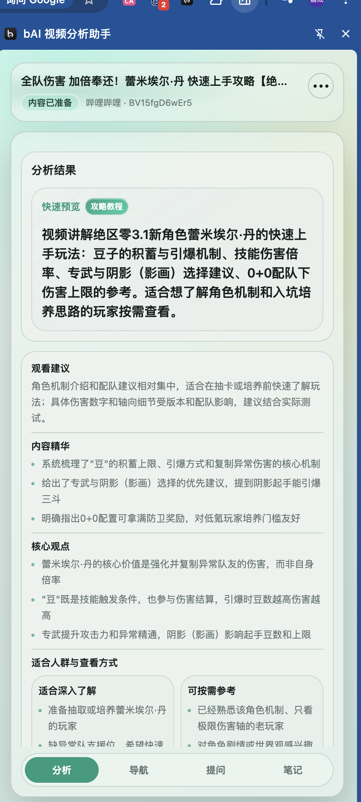
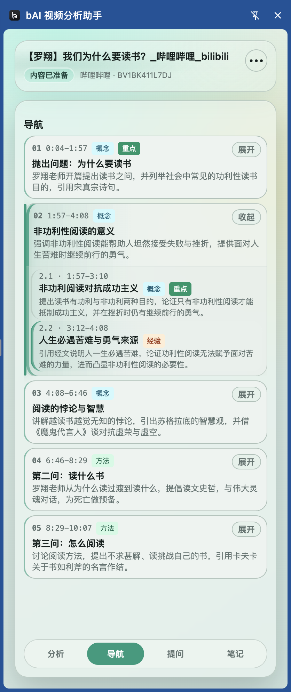
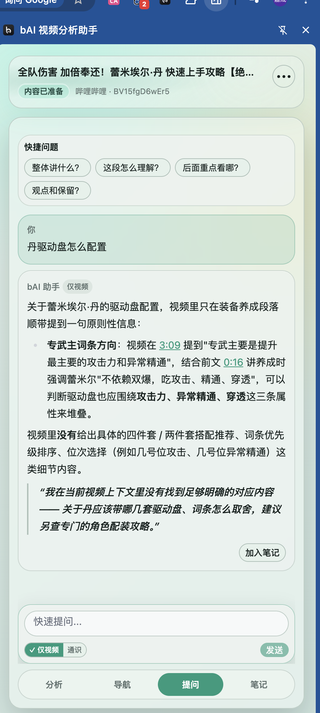

# bAI 视频分析助手

<p align="center">
  
</p>

<p align="center">
  <strong>支持哔哩哔哩和 YouTube 的视频分析、导航与问答。</strong><br />
  先看懂一条视频，再决定从哪里开始看。
</p>

<p align="center">
  <a href="https://github.com/PandaBai128/bai-video-analyzer/releases/latest">下载安装包</a>
  ·
  <a href="https://github.com/PandaBai128/bai-video-analyzer/issues">反馈问题</a>
  ·
  <a href="LICENSE">MIT License</a>
</p>


长视频不一定要从 `00:00` 开始看。

有些视频值得完整理解，有些只需要找到结论，有些更适合当作资料随时查询。**bAI 视频分析助手**会先把视频整理成一份快速预览，再给出可跳转的内容导航。看到不明白的地方，可以直接围绕当前视频追问；有用的回答还能加入笔记。

它不会替你给作者或视频下结论，而是尽量告诉你：**视频在讲什么、主要观点是什么、哪些地方值得优先查看，以及当前信息有哪些边界。**

## 一条视频，怎么用它

下面三张插件界面图来自同一条哔哩哔哩视频《【罗翔】我们为什么要读书？》，不是设计稿，也不是为演示单独制作的结果。

这个例子更接近 bAI 想做的事：**它不急着评价视频好不好，而是先帮你理解内容，再决定怎样投入时间。**

### 01 打开想看的视频

像平常一样打开 B 站视频，不需要下载或重新上传视频文件。插件会识别当前页面，并准备视频信息与可用字幕；内容准备完成后，即可在侧边栏生成分析或导航。

### 02 先看一份快速分析

分析页把这段约 10 分钟的演讲整理成快速预览、观看建议、内容精华、核心观点和适合人群。你可以先掌握“功利性阅读与非功利性阅读”这条主线，再决定完整观看还是按需参考。

<p align="center">
  <a href="docs/images/bai-analysis-example.png">
    
  </a>
</p>

### 03 用导航找到想看的部分

导航按照视频中的真实话题变化切分内容：为什么要读书、非功利性阅读的意义、阅读的悖论与智慧，以及应该读什么、怎么读。每个节点都有时间范围、内容类型和摘要，点击即可跳转。

### 04 围绕当前片段提问

播放到 `3:54` 时，可以直接问这一段在讲什么、与前后内容有什么关系。回答会结合当前片段解释观点，并给出视频中的时间引用，方便回到原处核对。

<table>
  <tr>
    <td width="50%" align="center"><strong>内容导航</strong></td>
    <td width="50%" align="center"><strong>片段问答</strong></td>
  </tr>
  <tr>
    <td>
      <a href="docs/images/bai-navigation-example.png">
        
      </a>
    </td>
    <td>
      <a href="docs/images/bai-question-example.png">
        
      </a>
    </td>
  </tr>
</table>

这就是插件目前最核心的使用路径：**先预览，再定位；需要时深入观看，遇到疑问就围绕视频追问。** 点击上面的图片可以查看原图。

## 它能做什么

### 快速分析

不用先看完整条视频，就能了解：

- 视频主要讲什么，属于攻略、教程、访谈、观点还是其他内容。
- 核心结论、主要观点和可复用的内容精华。
- 哪些信息适合深入了解，哪些只需要按需参考。
- 数字、观点、经验和适用前提中有哪些需要保留判断的地方。

### 内容导航

把视频整理成可点击的章节和小节：

- 每个节点都有时间范围、标题和一句话说明。
- 用 `重点 / 选看 / 可跳` 帮助安排观看顺序。
- 区分概念、方法、演示、案例、配置、对比、经验、总结等内容类型。
- 点击节点即可跳到对应位置，适合长播客、课程、技术分享和攻略视频。

### 围绕视频提问

你可以问整条视频，也可以问当前正在播放的片段：

- “这条视频整体讲了什么？”
- “作者为什么得出这个结论？”
- “这一段和前面的观点有什么关系？”
- “视频里有没有讲具体配置？”

回答会尽量引用视频中的时间点。选择“仅视频”时，找不到足够依据就会明确说明；需要补充背景知识时，也可以切换到“通识”。

### 笔记与导出

有用的问答可以直接加入笔记，也可以补充自己的记录。整理完成后可导出 Markdown，继续放进自己的知识库或笔记软件。

## 适合这些视频

- 知识讲解、课程、技术分享和产品分析。
- 长播客、访谈、演讲和观点讨论。
- 游戏攻略、软件教程和复杂操作演示。
- 想先快速预览，再决定如何投入时间的视频。

娱乐视频、纯音乐或没有可用字幕的视频，也许不适合交给它分析。

## 三分钟开始


### 1. 安装插件

目前尚未上架 Chrome Web Store，推荐使用 Release 中的 ZIP 包：

1. 从 [Releases](https://github.com/PandaBai128/bai-video-analyzer/releases/latest) 下载 `bai-video-analyzer-v0.1.0.zip`。
2. 解压文件，打开 Chrome 的 `chrome://extensions/`。
3. 开启“开发者模式”，选择“加载已解压的扩展程序”。
4. 选择解压后的 `dist` 文件夹，然后把 bAI 固定到工具栏。

Release 同时提供 CRX，适合小范围测试；部分 Chrome 版本会限制直接安装未上架商店的 CRX，此时请改用 ZIP 方式。

### 2. 使用公共体验服务

打开插件设置，进入“模型服务”，选择“bAI 免费服务”，填写：

```text
thankyoupanda
```

这是公开共享的邀请码，**每天共有 1000 次、每周共有 5000 次调用额度，先到先得**。我的模型 API 额度有限，所以目前只能提供这些；公共服务可能因为额度、维护或滥用临时不可用，也不承诺长期稳定性。

> [!WARNING]
> 当前公共体验服务使用 **HTTP**。邀请码、服务签发的临时 token，以及提交给模型的视频字幕和问题，可能在网络链路中以明文传输。请勿用它处理敏感视频或敏感问题；这类内容应改用你自己的 **HTTPS Provider**。
>
> 为公共体验服务提供有效 HTTPS，并随后移除扩展对公网 HTTP 的连接例外，是正式上线前的阻塞项。基础设施完成迁移前，这项风险仍未彻底解决。

### 3. 或者使用自己的 API

你也可以在设置中选择“使用自己的大模型”，填写自己的服务信息。这样不会占用公共邀请码额度。

目前我手上只有 **MiniMax**，所以 MiniMax 是实际持续测试的模型。界面中提供的其他兼容接口还没有逐一实测，可能存在模型名、返回格式或流式输出差异。欢迎提交 issue 告诉我结果，也欢迎直接修改并提交 PR。

## 关于 B 站登录与字幕

**建议先在 Chrome 中登录哔哩哔哩。** B 站部分视频的字幕接口依赖登录状态；没有登录时，即使播放器可以正常观看，也可能无法取得字幕，从而不能生成分析、导航和问答上下文。

扩展会在本机读取 B 站登录 Cookie，并仅用于向 B 站请求视频信息和字幕。Cookie 不会发送给 bAI 免费服务或你配置的模型服务商。

另外需要注意：

- 不是每条 B 站或 YouTube 视频都有可用字幕。
- 字幕可能来自作者、平台自动识别或翻译轨道，准确度会影响分析结果。
- 插件会优先按浏览器语言选择字幕；没有匹配时再尝试中文、英文和其他可用轨道。

## 隐私与结果边界

- 分析、导航、问答和笔记默认保存在当前浏览器本地。
- 使用 AI 功能时，必要的视频字幕和问题会发送到当前选择的 bAI 服务或模型服务商。
- 自己填写的 API Key 保存在本机浏览器存储中。
- AI 可能误解字幕、遗漏上下文或给出错误结论，重要信息请回到视频原文核对。
- 请不要在 issue、截图或日志中公开 API Key、Cookie、Token、私人笔记或完整字幕。

## 反馈与参与

这个项目首先是为我自己的长视频使用习惯做的，也希望能遇到同样喜欢研究视频、技术和学习工具的人。

欢迎：

- 提交 [Issue](https://github.com/PandaBai128/bai-video-analyzer/issues) 反馈无法分析的视频、字幕问题或模型兼容情况。
- 分享真实使用样例和你希望加入的分析角度。
- 修正文案、改进交互或提交 PR。
- Fork 后改成更适合自己的版本。

## License

代码使用 [MIT License](LICENSE) 开源。
